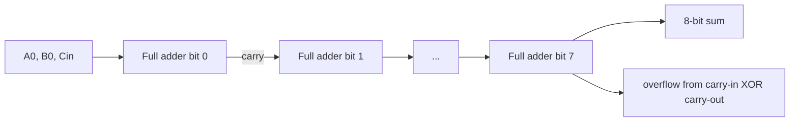
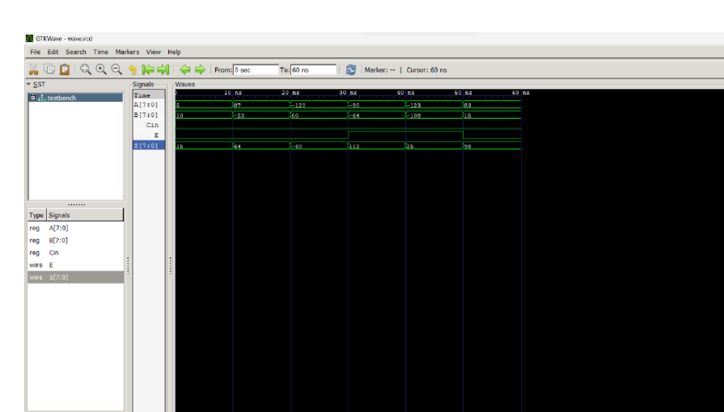

# 8-bit Signed Ripple-Carry Adder

## Overview

This project implements an 8-bit signed two's-complement adder using structural Verilog. The design avoids a word-level addition operator and instead builds the datapath hierarchically from reusable half-adder and full-adder cells.

The original submission report is preserved at:

[`original/8-bit-signed-ripple-carry-adder-report.pdf`](original/8-bit-signed-ripple-carry-adder-report.pdf)

## Architecture

The submitted design is organized into three levels:

1. **Half adder** - computes a one-bit sum with XOR and a carry with AND.
2. **Full adder** - combines two half adders and an OR gate to include carry-in.
3. **8-bit adder** - chains eight full-adder instances so each stage passes its carry to the next bit.

Signed overflow is generated by XORing the carry entering the sign bit with the final carry leaving it. This is the standard carry-based overflow condition for two's-complement addition.

## Verification cases in the submitted testbench

| Case | A | B | 8-bit result | Overflow |
|---:|---:|---:|---:|---:|
| 1 | 5 | 10 | 15 | 0 |
| 2 | 87 | -23 | 64 | 0 |
| 3 | -120 | 60 | -60 | 0 |
| 4 | -80 | -64 | 112 after 8-bit wraparound | 1 |
| 5 | -123 | -108 | 25 after 8-bit wraparound | 1 |
| 6 | 83 | 15 | 98 | 0 |

The original GTKWave screenshot shows the six input intervals and corresponding sum values.

## What this demonstrates

- decomposition of arithmetic hardware into reusable logic cells;
- structural module instantiation;
- propagation of carry through a multibit datapath;
- signed-number interpretation independent of the underlying bit pattern;
- distinction between the wrapped result and overflow status; and
- testbench-driven simulation using VCD waveform output.

## Scope and limitations

- The original source is embedded in the PDF rather than provided as standalone `.v` files.
- Verification uses a small directed set of test vectors rather than exhaustive testing.
- The design is fixed at 8 bits and is not parameterized.
- Propagation delay and synthesis timing are not analyzed.

These observations are documented without altering the submitted design.
