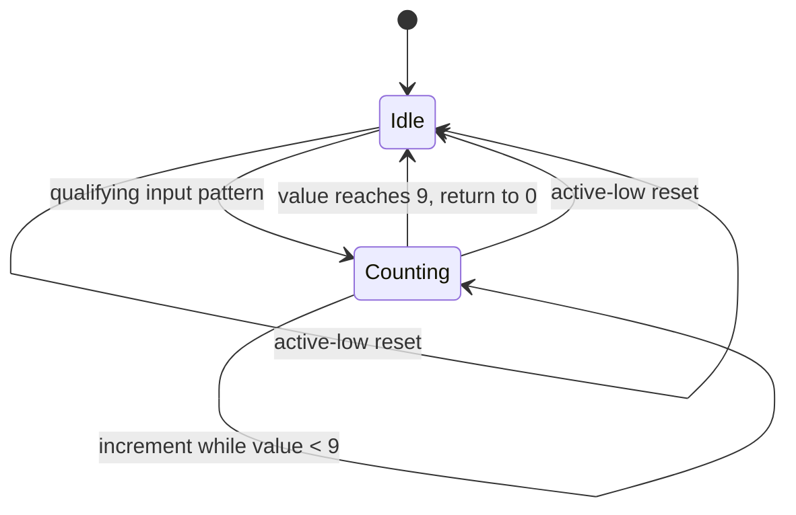
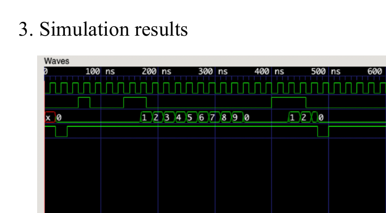

# Triggered Decimal Counter

## Overview

This project implements a 4-bit sequential counter in Verilog. After a qualifying input pattern is recognized while idle, the design enters a counting state, advances through decimal values, and returns to zero after reaching nine.

The original submission report is preserved at:

[`original/triggered-decimal-counter-report.pdf`](original/triggered-decimal-counter-report.pdf)

## Design structure

The submitted module uses three registers:

- `output_value` stores the 4-bit count;
- `is_counting` records whether an automatic count sequence is active; and
- `prev_bit` retains prior input information while the design is idle.

The sequential block is sensitive to the positive clock edge and the negative reset edge. When reset is low, all state is cleared. During an active count sequence, the output increments and returns to zero after nine.

## Testbench and waveform

The submitted testbench:

- generates a clock with a 20 ns period;
- drives predetermined 30-bit input and reset sequences;
- observes the 4-bit output value; and
- writes a `counter_tb.vcd` waveform file.

The preserved waveform shows a complete decimal sequence through 1, 2, ..., 9, followed by a return to 0. A later stimulus begins another sequence before reset clears the state.

## What this demonstrates

- clocked sequential logic;
- asynchronous active-low reset handling;
- register-based control state;
- conditional state transitions;
- automatic multi-cycle behavior after a trigger; and
- waveform-based verification of time-dependent logic.

## Scope and limitations

- The original source is embedded in the PDF rather than provided as standalone `.v` files.
- The triggering behavior is encoded through `prev_bit` and `input_signal` in the submitted implementation; it is not presented here as a generic reusable edge-detector module.
- The width and terminal count are fixed rather than parameterized.
- The testbench uses directed bit strings and does not contain assertions or self-checking pass/fail logic.
- No synthesis, FPGA deployment, or timing report is included.

These limitations are documented without changing the original implementation.
